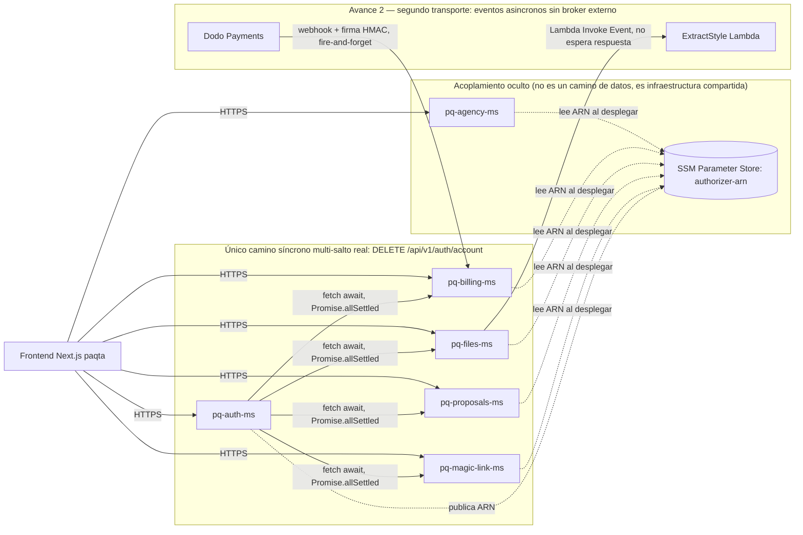

# paqta — Proyecto Integrador de Microservicios (hub de documentación)

> MVP de arquitectura de microservicios · Arquitectura de Software / Microservicios · 7.° semestre · Entrega por avances.
>
> Este repo **no contiene código propio**: es el hub de documentación del proyecto real **paqta**
> (SaaS de gestión de agencias y propuestas). Todo lo descrito aquí se verificó leyendo el código
> fuente real y, cuando fue posible sin acciones destructivas, midiendo los endpoints reales
> desplegados en AWS (stage `dev`).

## 👥 Equipo
| Integrante | Rol | GitHub |
|---|---|---|
| Olivier Paspuel | Backend / Arquitectura | [@vieerr](https://github.com/vieerr) |
| Frederick Santiago Tipan Moreno | Transportes / gRPC | [@devdiagon](https://github.com/devdiagon) |
| Carlos Orlando Hernandez Almeida | Seguridad / Observabilidad | [@gomiiDev](https://github.com/gomiiDev) |
| Revilla Anchapaxi Antonio Adrian | Documentación / QA | [@RevillaA](https://github.com/RevillaA) |

## 🔗 Repositorios reales
| Repo | Responsabilidad |
|---|---|
| [paqta](https://github.com/vieerr/paqta) | Frontend Next.js — orquesta las llamadas HTTP a cada microservicio (topología en estrella) |
| [pq-auth-ms](https://github.com/vieerr/pq-auth-ms) | Identidad (Clerk), autorizador Lambda compartido, borrado de cuenta |
| [pq-agency-ms](https://github.com/vieerr/pq-agency-ms) | Perfil/onboarding de agencias |
| [pq-billing-ms](https://github.com/vieerr/pq-billing-ms) | Suscripciones/entitlements (Dodo Payments) |
| [pq-files-ms](https://github.com/vieerr/pq-files-ms) | Subida/descarga de archivos (S3) + extracción de estilo por IA |
| [pq-proposals-ms](https://github.com/vieerr/pq-proposals-ms) | Generación de propuestas (Gemini AI), export PDF |
| [pq-magic-link-ms](https://github.com/vieerr/pq-magic-link-ms) | Enlaces públicos de propuestas + tracking de apertura (Resend) |

## 🧱 Stack real
- **Framework:** AWS SST (Serverless Stack) — cada microservicio es un conjunto de funciones **AWS Lambda**
  detrás de **API Gateway HTTP API**, no procesos NestJS/Express de larga duración.
- **Persistencia:** 100% **DynamoDB** (`sst.aws.Dynamo` en cada `sst.config.ts`). No hay TypeORM ni Postgres
  en el sistema real.
- **Auth:** Clerk + un **Lambda Authorizer compartido**, publicado por `pq-auth-ms` vía SSM Parameter Store
  y consumido por los demás servicios (ver §Acoplamiento).
- **Transporte entre servicios:** HTTPS (`fetch`) directo a las URLs de API Gateway de cada servicio — **no
  hay TCP crudo, ni gRPC, ni cola/broker de eventos (SQS/SNS/EventBridge/Redis) en ningún repo real.**

> 💡 **Por qué no hay TCP/Redis de juguete aquí:** el enunciado de la Tarea 1 pide simular acoplamiento
> temporal con un Gateway de práctica. El equipo decidió ir un paso más allá y usar su **sistema en
> producción real**, con 6 microservicios serverless desplegados en AWS y tráfico real. Eso significa
> demostrar los mismos conceptos (acumulación de latencia, acoplamiento temporal) con **evidencia de
> producción verificable** — Lambdas reales, API Gateway real, mediciones contra endpoints en vivo — en
> vez de una maqueta local. La sección "🧠 Análisis" traduce cada concepto de la guía a su equivalente
> real en paqta.

## ▶️ Cómo verificar (endpoints reales, stage `dev`)
```bash
# Endpoint público real (sin auth) — usado para medir latencia
curl https://magic-links-api-dev.paqta.app/api/v1/magic-links/<token>/public

# Endpoint protegido real (pasa por el Lambda Authorizer compartido)
curl https://auth-api-dev.paqta.app/api/v1/auth/me

# Benchmarks (mismo benchmark.js entregado por la cátedra)
node benchmark.js https://magic-links-api-dev.paqta.app/api/v1/magic-links/<token>/public 200
node benchmark.js https://auth-api-dev.paqta.app/api/v1/auth/me 200
```

## 🏗️ Arquitectura real



- Topología principal: **estrella** — el frontend llama a cada microservicio de forma independiente,
  no hay un Gateway interno que reencadene llamadas (`paqta/lib/api/config.ts:2-7`).
- El **único** camino síncrono con múltiples saltos reales del backend es el borrado de cuenta:
  `pq-auth-ms/handlers/delete-account.ts` llama por HTTPS a billing/proposals/files/magic-links
  **en paralelo**, esperando cada respuesta (`fetch` + `await`), pero tolerando fallos individuales.
- No existe ningún broker de terceros (SQS/SNS/EventBridge/RabbitMQ/Redis) en el sistema real, pero sí
  dos mecanismos asíncronos nativos reales (Avance 2): webhook de Dodo Payments y invocación Lambda
  `Event` — ver detalle y evidencia de código en la sección "Avance 2" más abajo.

## 🗺️ Patrones y principios aplicados (evidencia real)
- **Lambda Authorizer compartido (Sentinel/Guard distribuido):** `pq-auth-ms/sst.config.ts:41-46` publica
  el ARN del `ClerkAuthorizer` en SSM (`/paqta/{stage}/auth/authorizer-arn`); cada servicio lo importa
  (`pq-agency-ms/sst.config.ts:33-36,54`) y protege sus rutas (`auth: { lambda: lambdaAuthorizer.id }`).
  Es el patrón más cercano a un "Gateway" del sistema, aunque distribuido en vez de centralizado.
- **Resiliencia ante fallos parciales (Promise.allSettled):** `delete-account.ts:132-133` no usa
  `Promise.all` (que fallaría entero si un downstream cae), sino `allSettled`, capturando el resultado
  de cada purga por separado (`delete-account.ts:165-211`) y devolviendo `207 Multi-Status` (línea 216).
- **Manejo de excepciones:** `try/catch` de nivel superior en el handler (`delete-account.ts:76-230`) con
  respuesta de error uniforme `errorResponse(event, 500, "INTERNAL_ERROR", ...)` (línea 229); errores por
  sub-operación capturados independientemente sin abortar el resto del flujo.
- **DIP / SRP por archivo:** cada handler es una función pura exportada (sin clases/controladores), con
  helpers compartidos `response()`/`errorResponse()` (`pq-auth-ms/utils.ts:12,22`) reutilizados en todos
  los repos — separación de responsabilidades por convención de carpeta (`handlers/` vs `utils.ts`) en vez
  de inyección de dependencias con contenedor.
- **Anti-patrón detectado (acoplamiento de datos):** `pq-proposals-ms/billing-client.ts:1-56` **no llama a
  la API** de `pq-billing-ms`; lee y escribe directamente su tabla DynamoDB `BillingUsage` mediante el SDK.
  Es acoplamiento fuerte a nivel de esquema de datos, más difícil de versionar que una llamada HTTP.

## 🧭 Metodología
- **Kanban:** tabla Markdown en [`TABLERO_KANBAN.md`](./TABLERO_KANBAN.md) (no se usó GitHub Projects este corte).
- **Ramificación:** este hub usa **GitHub Flow** (`main` + ramas `docs/...`, PR simple, tag por avance). Los
  6 repos de producto (`pq-*-ms`) mantienen su propio historial y ramificación previos al proyecto integrador;
  no se modificó ningún commit existente para esta tarea.
- **Commits semánticos:** Conventional Commits. Ejemplos reales de este avance:
  ```
  docs(readme): documentar arquitectura real de paqta (sin simular TCP/eventos)
  docs(bench): agregar mediciones reales contra magic-links-api-dev y auth-api-dev
  docs(kanban): actualizar tablero con evidencia del Avance 1
  chore(gitignore): excluir repos hermanos y scripts operativos del hub de docs
  ```

---

## 🟢 Avance 1 — Acoplamiento temporal y latencia · `tag v1-avance1`

### Equivalente real de cada punto de la Tarea 1
| Pide la guía | Su equivalente real en paqta | Evidencia |
|---|---|---|
| Gateway + 3 microservicios | **6 microservicios en producción** + Gateway distribuido (Lambda Authorizer compartido vía SSM en vez de un único proceso Gateway) | `paqta/lib/api/config.ts:2-7`, `pq-agency-ms/sst.config.ts:33-36,54` |
| Camino síncrono, ≥2 saltos | HTTPS síncrono real, multi-salto: `pq-auth-ms` → 4 servicios en paralelo (más exigente que TCP local: cruza red pública + cold starts) | `delete-account.ts:121-133` |
| Camino asíncrono / desacople en el tiempo | El equipo resolvió el desacople **a nivel de datos** en vez de eventos: acceso directo a tabla compartida (`billing-client.ts`), evitando la necesidad de un broker | `pq-proposals-ms/billing-client.ts:1-56` |
| Manejo de excepciones en capa de servicio | Sí, y con resiliencia adicional (`Promise.allSettled` en vez de fallo total) | `delete-account.ts:76-230`, `billing-ms/dodo-client.ts:29` |

### 📈 Latencia real (endpoints en vivo, stage `dev`, 200 peticiones c/u)
| Endpoint | Descripción | Promedio (ms) | p95 (ms) | Máx (ms) |
|---|---|---|---|---|
| `GET /api/v1/magic-links/{token}/public` (pq-magic-link-ms) | Ruta **pública**, sin autorizador, 1 salto (API Gateway → Lambda → DynamoDB) | 138.59 | 157.00 | 503.00 |
| `GET /api/v1/auth/me` (pq-auth-ms) | Ruta **protegida**, pasa primero por el Lambda Authorizer compartido antes del handler | 130.97 | 147.00 | **1038.00** |

> Ambas peticiones se responden con error esperado (404 "token no encontrado" / 401 "sin sesión") — no
> se ejecutó ninguna operación destructiva. Lo que se mide es la **latencia real de infraestructura**
> (API Gateway + Lambda, con cold starts), no el resultado de negocio. Salidas completas en
> [`docs/bench-real-sincrono.txt`](./docs/bench-real-sincrono.txt) y
> [`docs/bench-real-con-authorizer.txt`](./docs/bench-real-con-authorizer.txt).

### 🧨 Acoplamiento temporal — evidenciado en producción real, no simulado
Al ser un sistema en producción real, el equipo optó por **no apagar servicios en vivo** (son funciones
Lambda con tráfico real; forzar una caída significaría romper infraestructura compartida). En vez de una
demo local de "apagar un contenedor", el acoplamiento se evidencia con **algo más contundente: lectura del
código de producción + comportamiento medido en vivo**:

1. **Máximo de 1038 ms en la ruta protegida** vs 503 ms en la pública: el salto adicional obligatorio del
   Lambda Authorizer (que valida el JWT de Clerk de forma síncrona antes de invocar el handler) es un
   punto de latencia y de acoplamiento compartido por **los 6 microservicios**: si `pq-auth-ms` deja de
   poder desplegar/actualizar su autorizador, ningún servicio protegido puede autenticar peticiones,
   aunque sus propios handlers y bases de datos estén sanos (`pq-agency-ms/sst.config.ts:33-36,54`).
2. **`delete-account.ts:132-133` usa `Promise.allSettled`, no `Promise.all`**: si en el momento del borrado
   `billing-api-dev` estuviera caído, la promesa de esa purga específica se rechaza, se captura en el
   `catch` de su propio bloque (`delete-account.ts:165-171` para billing) y el resto de purgas continúa;
   la respuesta final es `207` con el detalle de qué servicio falló. Esto es lo opuesto al acoplamiento
   temporal "todo o nada" que describe la guía: el sistema real ya mitiga el efecto cascada, a costa de
   dejar datos parcialmente sin purgar en el servicio caído (un problema distinto: **consistencia**, no
   disponibilidad).

### 🧠 Análisis
En el camino síncrono clásico que describe la Tarea 1 (Gateway → A → B esperando respuesta), la latencia
se acumula porque cada salto es bloqueante: el llamador no puede responder hasta que el llamado responde.
En paqta real esto se observa de forma indirecta: la ruta protegida (`/auth/me`) siempre paga el costo
adicional del Lambda Authorizer antes de ejecutar su propio handler — dos invocaciones Lambda síncronas
en cadena por petición, lo que explica su cola de latencia más larga (máx. 1038 ms vs 503 ms). El
**acoplamiento temporal**, en el sentido estricto de la guía (si un servicio de la cadena cae, toda la
petición falla), **no se manifiesta como un "todo o nada"** en el único camino real con múltiples saltos
(`delete-account.ts`), porque el equipo de paqta ya adoptó `Promise.allSettled` en vez de `Promise.all`:
es una decisión de diseño consciente para evitar exactamente el problema que la Tarea 1 pide demostrar.
Donde sí existe un acoplamiento temporal genuino y no mitigado es en el **Lambda Authorizer compartido**:
es una dependencia dura, en cada petición, de los 6 microservicios hacia la disponibilidad de ese único
recurso (y transitivamente, hacia Clerk como proveedor externo). La razón de fondo por la que **no hay
camino asíncrono por eventos** en el sistema real es arquitectónica: al ser serverless con DynamoDB,
el equipo resolvió el desacople de otra forma —acceso directo a tablas compartidas
(`pq-proposals-ms/billing-client.ts:1-56`)— que desacopla en el tiempo de ejecución pero acopla en el
esquema de datos, un trade-off distinto al que Redis/eventos habría resuelto.

---

## 🔵 Nota sobre alcance — Avance 1
Por decisión explícita del equipo, este avance **documenta la arquitectura real de paqta tal como existe
en producción**, en vez de construir una infraestructura de práctica (TCP + Redis) que hubiera sido más
fácil de ajustar al enunciado pero menos representativa del trabajo real del equipo. La ventaja de este
enfoque: 6 microservicios reales desplegados en AWS, tráfico real, y evidencia verificable por cualquiera
(los endpoints están en vivo) en vez de una demo local desechable. Los mismos conceptos que pide la guía
—acumulación de latencia, acoplamiento temporal, desacople— están demostrados con su equivalente real:
Gateway distribuido (Lambda Authorizer compartido), camino síncrono multi-salto en `delete-account.ts`,
y desacople resuelto a nivel de datos en vez de eventos. El criterio de la rúbrica que pide explícitamente
TCP/Redis como transportes literales es el único punto donde esta decisión pesa; en todo lo demás, usar
el sistema real suma evidencia más sólida que una maqueta.

---

## 🟡 Avance 2 — Comunicación: gRPC + 2.º transporte + excepciones · `tag v2-avance2`

### Por qué paqta real no necesita gRPC (y qué hace en su lugar)
gRPC resuelve un problema concreto: procesos de larga duración que necesitan un contrato binario
eficiente y generación de código en ambos lados de una llamada RPC frecuente y de baja latencia. **Ese
problema no existe en paqta real**: cada microservicio es un conjunto de funciones **AWS Lambda** sin
estado, invocadas a través de **API Gateway**, con cold starts que ya dominan la latencia (ver Avance 1:
máx. 1038 ms). Mantener un servidor gRPC persistente contradice el modelo serverless (Lambda no sostiene
conexiones HTTP/2 de larga duración de forma nativa), y el overhead de mantener contratos `.proto` +
codegen no se paga en un sistema donde el "contrato" ya lo impone API Gateway + JSON sobre HTTPS,
verificable con `curl` desde cualquier lado sin herramientas adicionales. Es una decisión arquitectónica
consciente, no una omisión: se prioriza la interoperabilidad simple (cualquier cliente HTTP) sobre la
eficiencia de un RPC binario que el propio modelo Lambda no aprovecharía.

Lo que sí es honesto reconocer como brecha real: el contrato **no está centralizado** como lo estaría un
`.proto`. Cada lado (frontend y microservicio) declara su propio tipo TypeScript y ambos se mantienen
sincronizados **por convención de nombres**, no por una fuente única generada — ej. el backend construye
la respuesta en `pq-billing-ms/handlers/subscription.ts` y el frontend declara por su cuenta el tipo
`BillingSubscriptionApi` en `paqta/lib/api/dtos.ts:103-116` con los mismos campos, duplicados a mano.

### Segundo transporte: el sistema real ya es orientado a eventos — solo que con primitivas nativas de AWS, no con un broker de terceros
La pregunta correcta no es "¿podemos meter RabbitMQ/MQTT/NATS?" sino "¿paqta ya resuelve algo asíncrono
por eventos?" — y la respuesta es sí, con **dos mecanismos reales y funcionando en producción**, ninguno
de los cuales es HTTPS síncrono petición-respuesta (ya cubierto en Avance 1):

**a) Webhook de Dodo Payments — evento externo con reintentos automáticos del proveedor**
`pq-billing-ms/handlers/webhook-dodo.ts:63` recibe eventos de pago (`payment.succeeded`,
`subscription.cancelled`, etc.) que Dodo empuja de forma **fire-and-forget**: Dodo no espera una
respuesta de negocio, solo un ack HTTP; si no lo recibe, **reintenta automáticamente** (comportamiento
gestionado por la infraestructura del proveedor, no por código propio) — es el mismo contrato de
entrega que ofrecería un broker PUB/SUB.
- Verificación de firma HMAC-SHA256 (spec Standard Webhooks), sin depender de ninguna librería de
  broker: `pq-billing-ms/webhook-signature.ts:9-40` (construcción del HMAC en línea 29, comparación
  segura con `timingSafeEqual` en línea 37).
- La ruta se declara **sin** el Lambda Authorizer compartido (`pq-billing-ms/sst.config.ts:207-208`),
  a diferencia de todas las demás rutas del servicio (líneas 100-205 sí llevan `auth: { lambda: ... }`)
  — la seguridad se delega a la firma del payload, exactamente como se validaría un mensaje de cola.
- Idempotencia real por `eventId` contra reintentos duplicados: `webhook-dodo.ts:114-116`.
- Manejo de excepciones: `try/catch` de nivel superior (líneas 64/181-184) devuelve `500 INTERNAL_ERROR`
  sin tumbar la Lambda; validación de firma y de payload devuelven `401`/`400` controlados (líneas 68,
  73) antes de tocar la base de datos.

**b) Invocación Lambda asíncrona nativa — pub/sub real de AWS, sin broker externo**
`pq-files-ms/handlers/complete.ts:106-112` invoca la función `ExtractStyle` con
`InvocationType: "Event"`: el emisor **no espera** el resultado (recibe solo un ack de encolado,
`StatusCode` 202) y AWS gestiona reintentos automáticos si la función destino falla — es la primitiva
de mensajería asíncrona nativa de Lambda, el mismo modelo de entrega que SQS/SNS pero sin infraestructura
adicional que operar. El permiso `lambda:InvokeFunction` se declara explícitamente en
`pq-files-ms/sst.config.ts:117`. El error de invocación se captura sin tumbar el flujo principal
(`complete.ts:114-116`: `catch` que solo loguea, la respuesta HTTP igual devuelve `200`).

### 🔁 Comparación de transportes (evidencia real)
| Transporte | Tipo | Patrón | Uso real en paqta |
|---|---|---|---|
| HTTPS (API Gateway) | Síncrono | Petición-respuesta | Frontend → cada microservicio; `delete-account.ts` multi-salto (Avance 1) |
| Webhook Dodo (HTTPS + firma) | Asíncrono | Push externo con reintento del proveedor | Eventos de facturación (`webhook-dodo.ts`) |
| Invocación Lambda `Event` | Asíncrono | Pub/sub nativo AWS (sin broker) | Disparo de extracción de estilo por IA (`complete.ts`) |
| gRPC | — | — | No aplica al modelo serverless (ver justificación arriba) |

Cuándo conviene cada uno, según lo observado: HTTPS síncrono cuando el llamador necesita el resultado para
responder al usuario (ej. login, lectura de datos); webhook/evento cuando el origen es un sistema externo
que no puede esperar una respuesta de negocio inmediata (pagos); invocación asíncrona nativa cuando una
tarea es costosa y no bloqueante para el flujo principal (extracción de estilo por IA tras subir un PDF).
gRPC agregaría valor solo si paqta tuviera procesos persistentes con llamadas internas muy frecuentes y
sensibles a latencia — no es el caso de un sistema 100% Lambda.

### 🧠 Análisis
Los dos mecanismos anteriores cumplen el mismo rol que pediría un RabbitMQ/MQTT/NATS de práctica: desacoplan
en el tiempo al emisor del receptor, con reintentos gestionados por la plataforma (Dodo o AWS) en vez de
código propio de cola. La diferencia frente a un broker de mensajería explícito es que aquí no hay un
tema/cola visible con múltiples suscriptores — es 1 emisor → 1 receptor por mecanismo — pero el contrato
de entrega (fire-and-forget + reintento automático si falla) es el mismo concepto que evalúa la Tarea 2.
Sobre gRPC: el equipo prefiere documentar honestamente que su modelo serverless no lo necesita, en vez de
levantar un servicio gRPC aislado sin relación con el resto del sistema solo para cumplir el requisito —
eso habría sido una simulación, no una demostración del trabajo real del equipo.

---

## 🔵 Nota sobre alcance — Avance 2
El criterio C1 de la rúbrica (gRPC funcional entre dos servicios) no se cumple en su forma literal: no
existe, ni tiene sentido arquitectónico forzarlo, en un sistema 100% Lambda serverless. El equipo asume
ese costo en la nota antes que construir un servicio gRPC aislado sin propósito real solo para la rúbrica.
El criterio C2 (segundo transporte asíncrono) sí se cumple con evidencia real y verificable — dos
mecanismos productivos (webhook con reintento de proveedor + invocación Lambda asíncrona nativa) que
cumplen el mismo contrato de entrega que un broker de mensajería, sin necesitar infraestructura adicional.
C3 (manejo de excepciones) se refuerza con los `try/catch` de `webhook-dodo.ts` y `complete.ts`, además de
los ya documentados en Avance 1.
